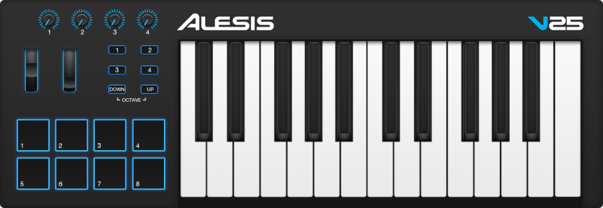

# Alesis V25

Source: Screenshot of Alesis V25 Editor

## Features
The Alesis V25 is a MIDI keyboard with
* 25 velocity sensitive full size keys
* 8 velocity sensitive drum pads
* 4 switches
* 4 rotary potentiometers
* pitch wheel
* mod wheel

## Instalaltion
Install the script (`device_Alesis_V25.py`) to the user data folder as described in the main `README.md`. Next send `configuration.v25` to the controller using the manufacturers utility [Alesis V25 Editor](https://alesis.com/products/view2/v25).

## Overall settings
The velocity curves are adjusted to make it feel more responsive.

This script provides two modes: Transport Mode and FPC Mode. For switching switches 1 and 2 can be used. Switches 3 and 4 can be used as usual. To make the LEDs work correctly make sure to set the input and the output device called `V25` to the same dedicated port. Unfortunately, there is no visual feedback on which mode is currently selected.

### Transport Mode (default) - Switch 1
This mode can be activated with switch 1. It maps the drum pads the following way:
* Pad 1: pattern/song mode
* Pad 2: play/pause
* Pad 3: stop
* Pad 4: record
* Pad 5-8: deactivated to prevent unwanted triggering

### FPC Mode - Switch 2
The FPC Mode remaps the drum pads to play the notes with default FPC settings. It maps the drum pads the following way:
* Pad 1: Crash
* Pad 2: Closed Hat
* Pad 3: Pedal HiHat
* Pad 4: Open HiHat
* Pad 5: Kick Drum
* Pad 6: Snare 1
* Pad 7: Snare 2
* Pad 8: SideStick